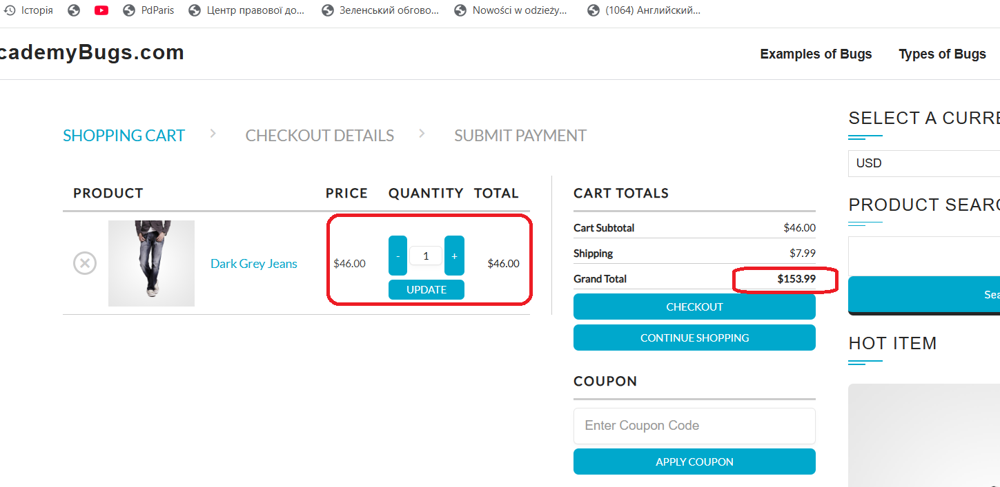
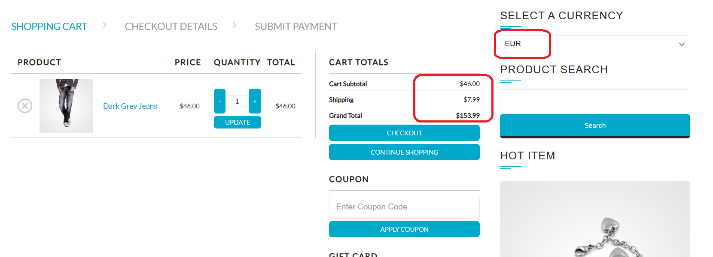

# Bug Reports

This document contains sample bug reports created during testing practice.

---

## BUG-001: Second product card height differs from other product cards

**Type:** UI  
**Severity:** Minor  
**Priority:** Medium  
**Environment:** Windows 10 Pro / Chrome 140.0.7339.128  

### Steps to Reproduce
1. Open https://academybugs.com/find-bugs/  
2. Observe the second product card "Dark Grey Jeans"

### Expected Result
All product cards have same height and alignment

### Actual Result
The second product card has a smaller height than the others

---

## BUG-002: Grand Total is calculated incorrectly in cart

**Type:** Functional  
**Severity:** Critical  
**Priority:** High  
**Environment:** Windows 10 Pro / Chrome 140.0.7339.128  

### Steps to Reproduce
1. Open https://academybugs.com/find-bugs/  
2. Add any product to cart  
3. Click "Update" under the Quantity field  
4. Check the "Grand Total"

### Expected Result
Grand Total should be equal to Cart Subtotal + Shipping

### Actual Result
Grand Total is calculated incorrectly

### Screenshot

### Notes
This issue affects the final order amount

---

## BUG-003: Product price does not change after selecting another currency

**Type:** Functional  
**Severity:** Major  
**Priority:** Medium  
**Environment:** Windows 10 Pro / Chrome 140.0.7339.128  

### Steps to Reproduce
1. Open https://academybugs.com/find-bugs/  
2. Add any product to cart  
3. Select another option in "Select a Currency"

### Expected Result
Product price and currency should update according to selected option

### Actual Result
Price and currency remain unchanged
### Screenshot

### Notes
User may see incorrect pricing information

---

## BUG-004: Sign In button overlaps footer

**Type:** UI  
**Severity:** Minor  
**Priority:** Low  
**Environment:** Windows 10 Pro / Chrome 140.0.7339.128  

### Steps to Reproduce
1. Open https://academybugs.com/find-bugs/  
2. Add any product to cart  
3. Scroll to the bottom of the right-side menu

### Expected Result
Sign In button is displayed correctly without overlapping elements

### Actual Result
Sign In button overlaps the footer

---

## BUG-005: Billing Address section does not behave as expected

**Type:** Functional  
**Severity:** Major  
**Priority:** Medium  
**Environment:** Windows 10 Pro / Chrome 140.0.7339.128  

### Steps to Reproduce
1. Open https://academybugs.com/find-bugs/  
2. Open a product page  
3. Log in or sign up  
4. Open Dashboard  
5. Navigate to Billing Address section

### Expected Result
The Billing Address section shows appropriate info

### Actual Result
The Billing Address section loads infinitely

---

## BUG-006: Cannot increase product quantity above 2 in cart

**Type:** Functional  
**Severity:** Major  
**Priority:** High  
**Environment:** Windows 10 Pro / Chrome 140.0.7339.128  

### Steps to Reproduce
1. Open https://academybugs.com/find-bugs/  
2. Add product to cart  
3. Open "View Cart"  
4. Set quantity to 3 or more  
5. Click "Update"

### Expected Result
User can increase quantity based on available stock

### Actual Result
Quantity cannot be increased above 2

### Notes
Limits user ability to purchase multiple items
